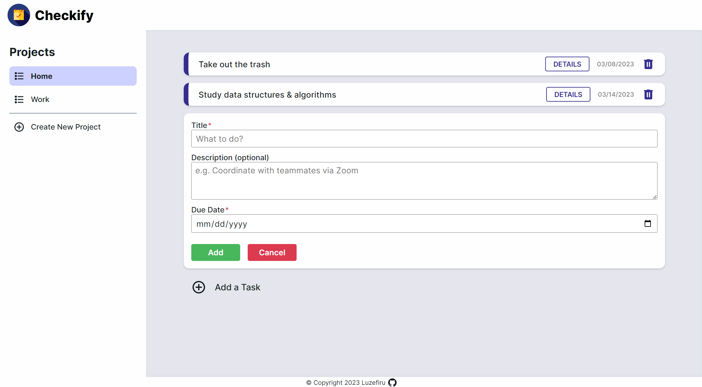
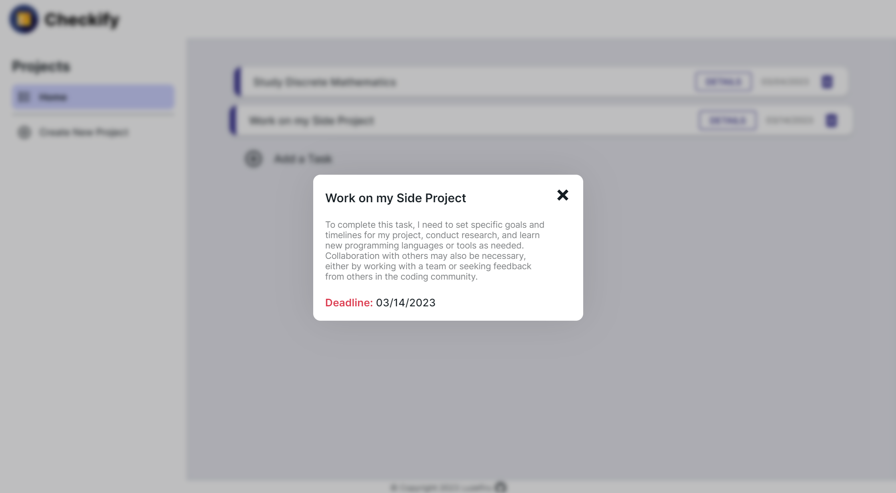

# odin-todo-list
A to-do list web application built with modular JavaScript code to practice Object-Oriented Design SOLID Principles.

This project was the biggest challenge I had thus far while undertaking The Odin Project. I plan to revisit and read about Objects in JavaScript so that I can fully utilize the Module Pattern.

My favorite CSS snippet was to recolor `.svg` images by turning them into a mask which I can then change the `background-color` of the actual `div`.

```CSS
.task--modal__exit-btn {
  mask: url(../res/close-thick.svg) no-repeat center;
  -webkit-mask: url(../res/close-thick.svg) no-repeat center;
  background-color: var(--primary);
}
```

I also learned how to make Modals using vanilla HTML using the `<dialog>` element. They have build-in JavaScript DOM Methods in order to give it functionality as it is `display: none` by default.

```JavaScript
modalOpenBtn.addEventListener('click', () => {
    modal.showModal();
    modal.classList.toggle('hidden');
});
modalCloseBtn.addEventListener('click', () => {
    modal.close();
    modal.classList.toggle('hidden');
});
```

I need to remember to give it `margin: auto` in order for it to be centered, then I can use `ch` units as the `width` or `min-width` for optimal responsive design.

```CSS
.task--modal {
    border: none;
    padding: 1.25rem;
    border-radius: 12px;
    width: 45ch;
    min-height: 10ch;
    margin: auto;
}
```

I need to improve on:
- modularizing my JavaScript code for easy modification
- using the Web Storage API to give persistence to my data
- using the `JSON.stringify()` and `JSON.parse()` methods to set & get data from `window.localStorage`.

# Output
### [Visit the Website Here](https://luzefiru.github.io/odin-todo-list/)



# Requirements
These were the requirements in The Odin Project's [Project: Todo List](https://www.theodinproject.com/lessons/node-path-javascript-todo-list) site to serve as project specifications. Website aesthetic choices and implementation solely depended on me, the programmer.